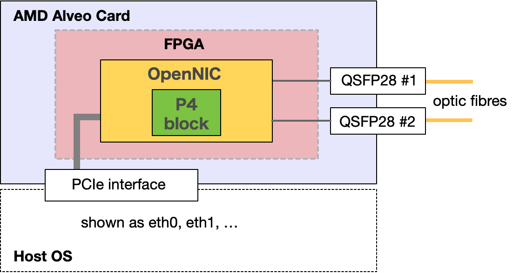

# Vitis Networking P4 Framework
With AMD's Vitis Networking P4, you can compile P4 code targeting Xilinx FPGAs.
However, Vitis Networking P4 only generates IP cores (functional blocks) for packet processing, and to actually function as an FPGA SmartNIC, you need to integrate Vitis Networking P4 with OpenNIC.

This project - Vitis Networking P4 Framework - automates this integration process.
In other words, using this Framework, even P4 programmers with no FPGA development experience can run their P4 code on Alveo FPGA SmartNICs.

Currently, this project implements support for all devices supported by OpenNIC.
However, we have only verified operation on Alveo U50.
If you encounter any issues with other devices, please let us know.

## Features
There are several possible design approaches for combining Vitis Networking P4 IP Blocks with OpenNIC.
For example, you can run Vitis Networking P4 IP Blocks at 250 MHz or 322 MHz, or separate IP Blocks for TX and RX, etc.
We have currently implemented an architecture with the simplest configuration where a single Logic Block handling both TX and RX operates at 250 MHz.

### shared_txrx_250

> P4 Block: Logic Block implemented with a specific architecture (included Vitis Networking P4 IP)

With this configuration, you can:

- Basic P4 programming
- Recognize up to 8 Network Interfaces (ethX)
- Port forwarding (ex. eth0 <-> QSFP28#1, eth0 <-> eth1, QSFP28#1 <-> QSFP28#2)
- Simple integration of User Externs (automatic loading of user's custom Verilog, SystemVerilog, TCL)

Additionally, for P4 End Users, we've designed an intuitive project directory structure to place necessary files.

## Getting Started

First, it's recommended to understand the sample project based on the following Design Spec.
Then, create your own VNP4 Project by referring to the sample projects.

- shared_txrx_250
    - [Design Spec](docs/shared_txrx_250/design_spec.md)
    - Sample Projects
        - [VNP4-Simple](https://github.com/iHalt10/vnp4_simple) - Simplest implementation
        - [VNP4-Table](https://github.com/iHalt10/vnp4_table) - Implementation of tables and controller
        - [VNP4-UserExtern](https://github.com/iHalt10/vnp4_user_extern) - Implementation of User Extern
