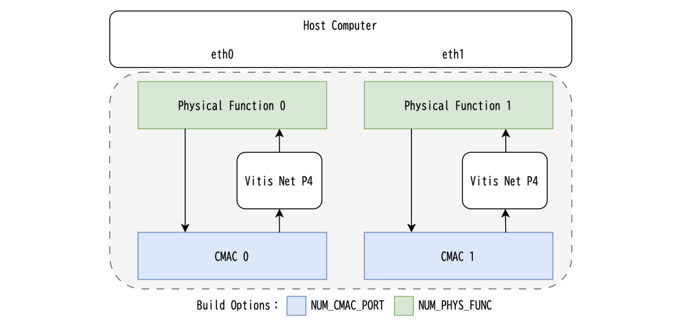
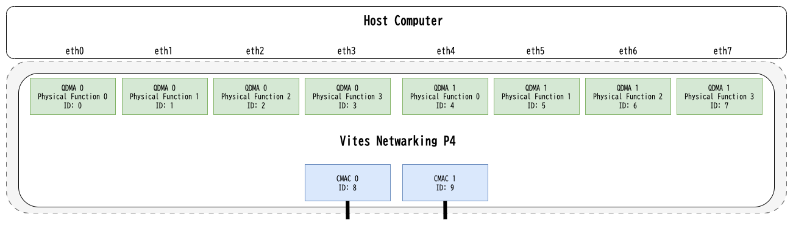

# Vites Networking P4 Framework
The framework integrates VitisNetP4 with OpenNIC Shell to compile P4 code into hardware IP.

## Architectures

### rx_only_250



The number of Physical Functions can be modified using `NUM_PHYS_FUNC` in the Makefile.
The number of CMACs can be modified using `NUM_CMAC_PORT` in the Makefile.
The maximum number of CMACs depends on the target device and supports the following:

- Max `NUM_CMAC_PORT`:
    - Alveo U50: 1
    - Alveo U55N: 2
    - Alveo U55C: 2
    - Alveo U200: 2
    - Alveo U250: 2
    - Alveo U280: 2
    - Alveo U45N: 2

Note that `NUM_PHYS_FUNC` and `NUM_CMAC_PORT` must be set to the same value.

When running two instances of Vitis Net P4, they will execute the same P4 program and share the same P4 Table entries.

### shared_txrx_250



The number of Physical Functions can be modified using `NUM_PHYS_FUNC` in the Makefile, with a maximum support of 4 functions.
The number of CMACs can be modified using `NUM_CMAC_PORT` in the Makefile.
The maximum number of CMACs depends on the target device and supports the following:

- Max `NUM_CMAC_PORT`:
    - Alveo U50: 1
    - Alveo U55N: 2
    - Alveo U55C: 2
    - Alveo U200: 2
    - Alveo U250: 2
    - Alveo U280: 2
    - Alveo U45N: 2

## Usage

### Preparation

#### Install Vitis/Vivado 2023.2.2

For GUI installation, enable the `Vitis Networking P4` checkbox under `Design Tools`.
For CLI installation, modify the `Modules=` entry in `install_config.txt` from `Vitis Networking P4:0` to `Vitis Networking P4:1`.

#### Obtain Xilinx IP Licenses

- CMAC license
    - [cmac-license (Github: OpenNIC Shell)](https://github.com/Xilinx/open-nic-shell?tab=readme-ov-file#cmac-license)
    - [UltraScale+ 100G Ethernet Subsystem (Xilinx)](https://japan.xilinx.com/products/intellectual-property/cmac_usplus.html)
- Vitis Networking P4 (sdnet_p4) license
    - [Vitis Networking P4 (Xilinx)](https://japan.xilinx.com/products/intellectual-property/ef-di-vitisnetp4.html)

#### Clone Project

```shell
$ git clone https://github.com/iHalt10/vnp4_framework
$ cd vnp4_framework
$ git submodule update --init --recursive
```

### Build OpenNIC Shell with User Plugins

```shell
$ make
```

#### Build Options
The following Makefile options are available for building:

```makefile
###########################################################################
##### OpenNIC Build Script Options (open-nic-shell/script/build.tcl)
###########################################################################
## Build options
BOARD           := au50
TAG             := vnp4_nic
JOBS            := $(shell nproc)
SYNTH_IP        := 1
IMPL            := 1
POST_IMPL       := 1

USER_PLUGIN     := $(abspath user_plugin/rx_only_250)

## Design parameters
BUILD_TIMESTAMP := $(shell date +%y%m%d%H%M)
MIN_PKT_LEN     := 64
MAX_PKT_LEN     := 1514
NUM_PHYS_FUNC   := 1
NUM_QDMA        := 1
NUM_CMAC_PORT   := 1
```

For detailed explanation of these options, refer to [Build Script Options (Github: OpenNIC Shell)](https://github.com/Xilinx/open-nic-shell?tab=readme-ov-file#build-script-options).

For the Architecture's `USER_PLUGIN`, specify one of the following:
- rx_only_250: `$(abspath user_plugin/rx_only_250)`
- shared_txrx_250: `$(abspath user_plugin/shared_txrx_250)`

### Program MCS/BIT Files

```shell
$ make program-bit # and hot reboot
# or
$ make program-mcs # and cold reboot
```

#### Program Options
The following Makefile options are available for programming:

```makefile
###########################################################################
##### Program Options
###########################################################################
PROGRAM_HW_SERVER   := 127.0.0.1:3121
PROGRAM_DEVICE_NAME := xcu50_u55n_0
PROGRAM_FLASH_PART  := mt25qu01g-spi-x1_x2_x4
```

### Build Management Table Tools (Software)

```shell
$ make sw
```
The following binaries will be generated:

- rx_only_250: sw/rx_only_250/bin
    - find_entry (doesn't work)
    - get_table_mode
    - insert
- shared_txrx_250: sw/shared_txrx_250/bin
    - find_entry (doesn't work)
    - get_table_mode
    - insert

### Build OpenNIC Driver

```shell
$ cd open-nic-driver
$ make
$ sudo insmod onic.ko
```

For detailed information, refer to [OpenNIC Driver Documentation (Github: OpenNIC Driver)](https://github.com/Xilinx/open-nic-driver).

### Management Table

- Supported P4 tables in Look-Up Engine:
    - [TinyBCAM](https://docs.amd.com/r/en-US/ug1308-vitis-p4-user-guide/TinyBCAM)
        - Key width: up to 1024 bits
        - Response width: up to 1024 bits
        - Size: Up to 32 entries
        - Range key match type not supported
    - [TinyTCAM](https://docs.amd.com/r/en-US/ug1308-vitis-p4-user-guide/TinyTCAM)
        - Key width: up to 1024 bits
        - Response width: up to 1024 bits
        - Size: Up to 32 entries
        - Range key match type not supported

### Device Setup

```shell
$ lspci -vd 10ee:
xx:xx.x Network controller: Xilinx Corporation Device 903f
$ sudo setpci -s xx:xx.x COMMAND=0x3
```

### Insert Table Entry

```shell
$ ./insert /sys/bus/pci/devices/xxxx:xx:xx.x/resource2
```
