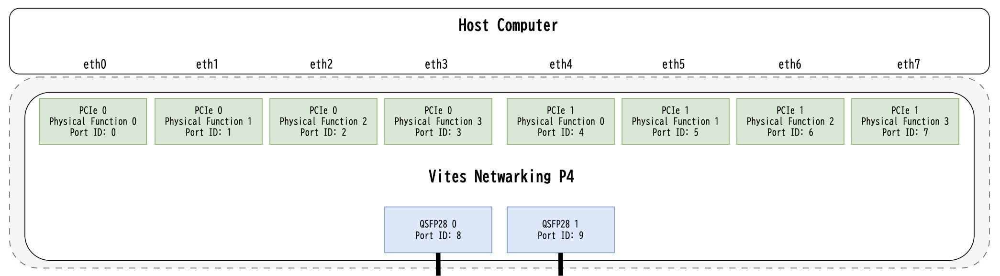

# Design Spec

## VNP4 Project Directory Structure

```
(project)
    ├── main.p4                  // You implement it.
    ├── user_externs/*           // You implement it. If use.
    ├── Makefile                 // Template.
    ├── sw                       // For operate tables, etc. If use.
    │   ├── Makefile             // Template. This Makefile is executed from "(project)/Makefile (make sw)".
    │   ├── common/              // Template. Libraries common to All P4 projects
    │   │   ├── include/*
    │   │   └── src/*
    │   ├── driver/*             // Generated by "make p4-drivers". "Control plane drivers" provided by VitisNetP4 IP.
    │   ├── include/*            // You implement it.
    │   |── src                  // You implement it.
    │   │   ├── a_module/*       // Example: separation of concerns in your project.
    │   |   └── cmd/*            // Bin source files. Each file has a main function.
    │   └── bin/*                // Generated by "make sw"
    ├── build
    │   ├── ip/*                 // Generated by "make generate-p4-ip"
    │   ├── open_nic_shell.bit   // Generated by "make build-open-nic-shell" and SYNTH_IP Makefile Param Enabled
    │   └── open_nic_shell.mcs   // Generated by "make build-open-nic-shell" and IMPL     Makefile Param Enabled
    └── vnp4_framework
        |── open-nic-shell/*
        └── (etc ...)
```

You can create the above structure with the following commands:
```shell
$ mkdir sample_project
$ cd sample_project
$ git clone https://github.com/iHalt10/vnp4_framework
$ cd vnp4_framework
$ git submodule update --init --recursive
$ cd ..
$ # Copy Template Makefile form https://github.com/iHalt10/vnp4_simple/blob/main/Makefile

$ # For operate tables, etc. If use.
$ # Copy Template sw/Makefile form https://github.com/iHalt10/vnp4_table/blob/main/sw/Makefile
$ # Copy Template sw/common form https://github.com/iHalt10/vnp4_table/blob/main/sw/common

$ vim main.p4
```

## Template Makefile

The following targets are supported:
```
################################################################################
# Makefile for VNP4 Project
#
# quick usage:
#   $ make                      # Build the entire project. same make build-open-nic-shell
#   $ make build-open-nic-shell # Build Open NIC Shell
#   $ make get-devices          # Show FPGA Device List
#   $ make program-bit          # Program FPGA with bitstream
#   $ make program-mcs          # Program flash memory with MCS file
#   $ make generate-p4-ip       # Generate Vitis Net P4 IP core from P4 file
#   $ make alias-custom-ip      # Create symbolic link to custom IP for Open NIC Shell
#   $ make p4-drivers           # Build p4-drivers
#   $ make sw                   # Build sw based on p4-drivers
#   $ make log                  # Show vnp4_framework/open-nic-shell/script/vivado.log
#   $ make ide                  # Open vivado GUI
#   $ make clean-log            # Remove vivado log files
#   $ make clean                # Remove generated files (not include BUILD_PATH)
#   $ make clean-all            # Remove generated files (include BUILD_PATH)
################################################################################
```

### make generate-p4-ip
If you want to check "P4 program syntax analysis" or "Verilog files generated from P4 program, and P4 driver" before generating the FPGA bitstream (`make build-open-nic-shell`), run `make generate-p4-ip`.
When executed, the following directory will be created:
- (project)/build/ip/vitis_net_p4_core/

Also, the following file is important when creating User Externs:
- (project)/build/ip/vitis_net_p4_core/src/verilog/vitis_net_p4_core_pkg.sv

## Ports Mapping



To change the number of PCIe Physical Functions, modify the `NUM_QDMA` and `NUM_PHYS_FUNC` parameters in (project)/Makefile.
The range for `NUM_QDMA` is "1 ~ 2".
The range for `NUM_PHYS_FUNC` is "1 ~ 4".
To change the number of QSFP28 ports, modify the value of the `NUM_CMAC_PORT` parameter in (project)/Makefile.
The range for `NUM_CMAC_PORT` is "1 ~ 2", but the maximum number depends on the number of QSFP28 ports on the device being used.

## User Metadata

```c
struct metadata_t {
    // *********************** Custom Metadata ********************************** //
    // NOTE: Sharing user custom metadata between parser/control blocks
    // ...
    // *********************** System Metadata (Do not delete) ****************** //
    bit<9>  egress_port;
    bit<9>  ingress_port;
    bit<16> packet_length;
}
```

For `egress_port` and `ingress_port` values, use the "Port ID" from "Ports Mapping".


## User Extern
Two files are required in (project)/user_externs:

- `(project)/user_externs/user_externs.svh`
- `(project)/user_externs/user_externs.sv`

In user_externs.svh, write the following:
```verilog
`ifndef __USER_EXTERNS_SVH__
`define __USER_EXTERNS_SVH__

`define ENABLED_USER_EXTERNS

`endif // __USER_EXTERNS_SVH__
```

Customize user_externs.sv based on the following:
```verilog
`timescale 1ns/1ps

`include "vitis_net_p4_core_pkg.sv"

import vitis_net_p4_core_pkg::NUM_USER_EXTERNS;
import vitis_net_p4_core_pkg::USER_EXTERN_OUT_WIDTH;
import vitis_net_p4_core_pkg::USER_EXTERN_IN_WIDTH;

module user_externs (
  input  [NUM_USER_EXTERNS-1:0]      user_extern_out_valid,
  input  [USER_EXTERN_OUT_WIDTH-1:0] user_extern_out,

  output [NUM_USER_EXTERNS-1:0]      user_extern_in_valid,
  output [USER_EXTERN_IN_WIDTH-1:0]  user_extern_in,

  input aclk,
  input aresetn
);

  ????_extern ????_extern_inst (
    .user_extern_out_valid (...),
    .user_extern_out       (...),
    .user_extern_in_valid  (...),
    .user_extern_in        (...),
    .aclk    (aclk),
    .aresetn (aresetn)
  );

endmodule: user_externs
```

Also, for multiple user_extern, the index of wiring for each user_extern such as `user_extern_out_valid`, `user_extern_out`, etc. can be confirmed from `vitis_net_p4_core_pkg.sv`.
